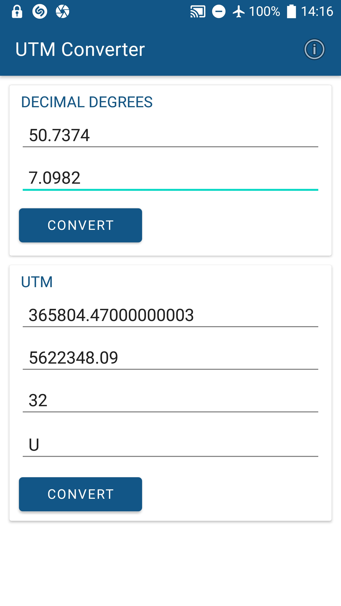

## Android UTM Converter
#### Introduction
This is a small tool to convert coodinates from (latitude/longitude) to UTM and vice versa. I wrote this back in 2017, now it's refactored with Androidx.
#### Download APK
You can download the APK file and run it on your mobile. (find it [here](docs/utm-converter.apk)).
#### Screens

